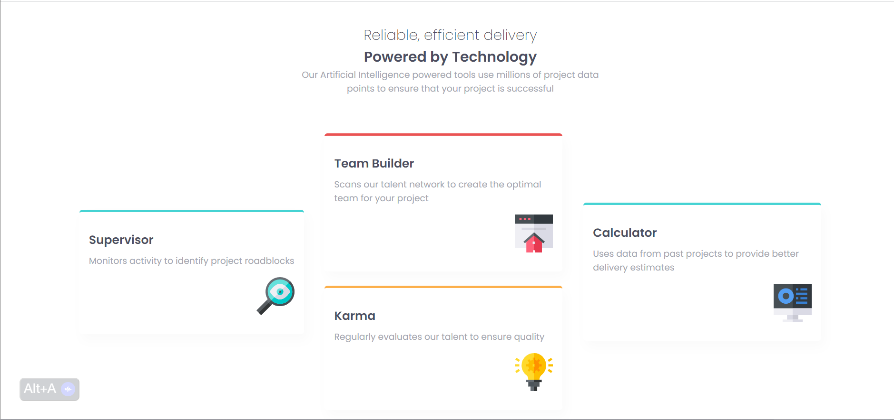

# Frontend Mentor - Four card feature section solution

This is a solution to the [Four card feature section challenge on Frontend Mentor](https://www.frontendmentor.io/challenges/four-card-feature-section-weK1eFYK). Frontend Mentor challenges help you improve your coding skills by building realistic projects. 

## Table of contents

- [Overview](#overview)
  - [The challenge](#the-challenge)
  - [Screenshot](#screenshot)
  - [Links](#links)
- [My process](#my-process)
  - [Built with](#built-with)
  - [What I learned](#what-i-learned)
  - [Continued development](#continued-development)
  - [Useful resources](#useful-resources)
- [Author](#author)
- [Acknowledgments](#acknowledgments)

## Overview

### The challenge

Users should be able to:

- View the optimal layout for the site depending on their device's screen size

### Screenshot

### Links

- Solution URL: [Add solution URL here](https://github.com/lawal-sherif-itunu/four-card-feature-section-master)
- Live Site URL: [Add live site URL here](https://lawal-sherif-itunu.github.io/four-card-feature-section-master)

## My process

### Built with

- Semantic HTML5 markup
- CSS custom properties
- CSS Grid
- Mobile-first workflow

### What I learned

Revisited CSS Grid and Flexbox tutorials.

### Continued development

JavaScript

### Useful resources

- [Example resource 1](https://youtu.be/EiNiSFIPIQE) - Grid tutorial.
- [Example resource 2](https://youtu.be/JJSoEo8JSnc) - Flexbox tutorial.

## Author

- Website - [Lawal Sherif Itunu](https://github.com/lawal-sherif-itunu)
- Frontend Mentor - [@lawal2000](https://www.frontendmentor.io/profile/lawal2000)
- Twitter - [@SlerifLawal12](https://twitter.com/SherifLawal12)

## Acknowledgments

Thanks to myself for not giving up.

